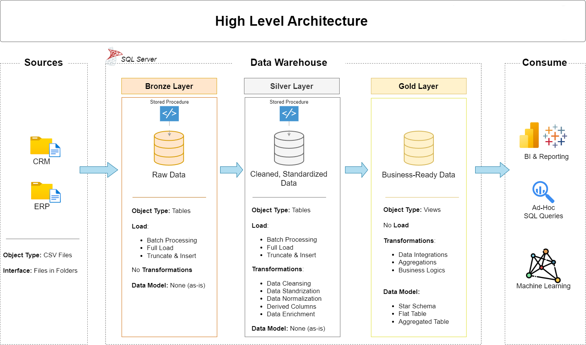
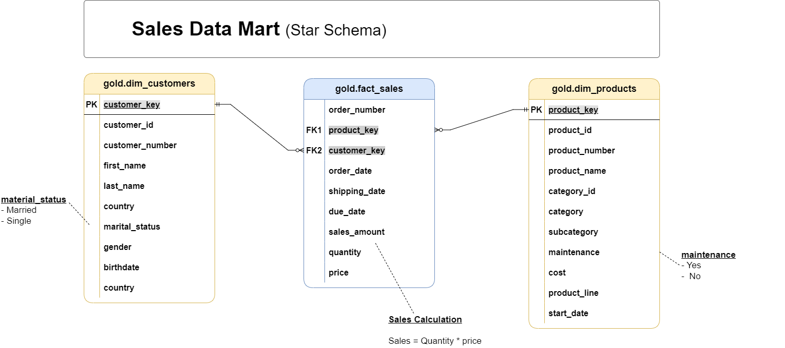

# Enterprise SQL Data Warehouse and Analytics Project

### Metadata-Driven ETL | Medallion Architecture | Change Data Capture (CDC) | Slowly Changing Dimensions (SCD Type 1 & 2) | Data Quality Framework | Audit Logging | Star Schema

---

## Overview

This project is an end-to-end **Enterprise Data Warehouse** built using **Microsoft SQL Server**. It integrates data from multiple **CRM and ERP source systems (CSV extracts)** into a centralized analytical warehouse using a layered **Medallion Architecture (Bronze → Silver → Gold)**.

The solution implements a production-oriented ETL framework with **metadata-driven ingestion**, **incremental loading**, **Change Data Capture (CDC)**, **Slowly Changing Dimensions (SCD Type 1 & Type 2)**, **data quality validation**, and **comprehensive audit logging**. The curated data is modeled into a **Star Schema** to support reporting, business intelligence, and analytical workloads.

To improve maintainability and operational visibility, the project includes configurable ETL pipelines, execution logging, data quality monitoring, reject-record handling, and centralized audit tables that enable reliable and traceable data processing.

---

# Problems Solved

This project addresses several common challenges encountered while building enterprise data warehouses:

### Centralized Data Integration

Integrated CRM and ERP datasets into a unified SQL Server data warehouse, eliminating fragmented reporting across multiple operational systems.

### Data Quality & Standardization

Implemented cleansing, validation, and standardization rules to improve data consistency before loading curated analytical datasets.

### Historical Data Tracking

Applied **Slowly Changing Dimension (SCD) Type 1** and **Type 2** techniques to manage changing business entities while preserving historical information where required.

### Efficient Incremental Processing

Reduced unnecessary full reloads by implementing a metadata-driven incremental loading framework using watermark tracking and HASHBYTES-based change detection.

### ETL Governance & Monitoring

Improved pipeline reliability through centralized execution logging, audit tables, reject-record capture, load statistics, and automated data quality validation.

### Analytical Performance

Designed a dimensional **Star Schema** with partitioning and optimized indexing strategies to improve query performance for reporting and analytics.

---

# Core Capabilities

### Data Integration

- Metadata-Driven ETL Framework
- Master ETL Orchestration
- Batch Processing
- Incremental Loading (Watermark Framework)
- Change Data Capture (CDC)

### Data Warehousing

- Medallion Architecture (Bronze → Silver → Gold)
- Star Schema Design
- Dimension & Fact Modeling
- Surrogate Key Generation

### Data Processing

- SCD Type 1
- SCD Type 2
- HASHBYTES (SHA2_256) Change Detection
- Data Cleansing & Standardization
- Business Rule Validation

### Data Quality & Governance

- Automated Data Quality Validation
- Reject Records Management
- Audit Logging
- ETL Execution Logging
- Load Statistics
- Error Handling (TRY...CATCH)

### Performance Optimization

- Clustered Columnstore Index
- Table Partitioning
- MERGE-Based Loading
- Optimized Analytical Queries

### Monitoring

- ETL Monitoring Dashboard
- Execution Status Tracking
- Data Quality Reporting
- Pipeline Audit Framework

---

# Data Architecture

The project follows a **Medallion Architecture**, where data progressively moves through three layers:

- **Bronze Layer** – Raw ingestion of CRM and ERP source data.
- **Silver Layer** – Data cleansing, standardization, validation, incremental processing, and historical data management.
- **Gold Layer** – Business-ready dimensional model optimized for reporting and analytics.



---

# Project Structure

```text
Enterprise-Data-Warehouse/
│
├── datasets/                         # Source CRM & ERP CSV files
│
├── docs/                             # Documentation & Architecture
│   ├── data_architecture.png
│   ├── data_flow.png
│   ├── data_integration.png
│   ├── data_model.png
│   ├── data_catalog.md
│   └── naming_conventions.md
│
├── scripts/
│   │
│   ├── audit/                        # Audit, governance & ETL control framework
│   │   ├── ddl_audit.sql
│   │   ├── seed_etl_config.sql
│   │   ├── proc_execution_logging.sql
│   │   └── proc_data_quality_checks.sql
│   │
│   ├── bronze/                       # Bronze layer (Raw ingestion)
│   │   ├── ddl_bronze.sql
│   │   └── proc_load_bronze.sql
│   │
│   ├── silver/                       # Silver layer (Transformation)
│   │   ├── ddl_silver.sql
│   │   ├── proc_load_silver.sql
│   │   └── proc_load_metadata_driven.sql
│   │
│   ├── gold/                         # Gold layer (Star Schema)
│   │   ├── ddl_gold.sql
│   │   └── proc_load_gold.sql
│   │
│   ├── monitoring/                   # Monitoring & Reporting
│   │   └── etl_monitoring_dashboard.sql
│   │
│   ├── security/
│   │   └── ddl_security.sql
│   │
│   ├── init_database.sql
│   └── init_load_all.sql
│
├── Data Analytics/                   # Business reporting & analytical SQL
│
├── tests/
│   ├── quality_checks_silver.sql
│   ├── quality_checks_gold.sql
│   └── scd_validation_checks.sql
│
├── .gitignore
└── README.md
```

---

# Data Model

The Gold layer follows a **Star Schema** consisting of dimension tables and fact tables designed for reporting and analytical workloads.



---
# ETL Workflow

The ETL pipeline follows a **Bronze → Silver → Gold** architecture, where each layer has a clearly defined responsibility for ingesting, refining, and delivering analytics-ready data.

---

# Bronze Layer – Raw Data Ingestion

**Source Systems**

- CRM CSV Extracts
- ERP CSV Extracts

**Stored Procedure**

`bronze.load_bronze`

### Responsibilities

The Bronze layer acts as the landing zone for raw source data. Data is loaded exactly as received without applying business transformations.

### Processing

- Batch Processing
- Full Data Load
- BULK INSERT for high-speed ingestion
- Truncate & Reload strategy
- Batch ID generation for traceability

### Audit & Logging

- ETL execution recorded in `audit.etl_log`
- Step-level execution tracking through `audit.etl_execution_log`
- Table load statistics captured in `audit.table_statistics`
- Centralized TRY...CATCH error handling

### Output

- Raw source tables
- Batch-level audit information
- Execution logs
- Load statistics

---

# Silver Layer – Data Cleansing & Transformation

**Stored Procedures**

- `silver.load_silver`
- `silver.load_metadata_driven`

The Silver layer transforms raw operational data into standardized, validated, and analytics-ready datasets.

---

## Data Cleansing

The pipeline performs several cleansing and standardization operations, including:

- Duplicate removal
- Missing value handling
- Data standardization
- Invalid date correction
- Country normalization
- Code standardization
- Data format consistency
- Revenue recalculation and validation
- Identifier cleanup

---

## Incremental Loading

Incremental processing minimizes unnecessary reloads while ensuring data freshness.

The implementation includes:

- Watermark-based incremental loading
- HASHBYTES (SHA2_256) change detection
- MERGE-based upserts
- Change Data Capture (CDC)

---

## Slowly Changing Dimensions

### Customer Dimension (SCD Type 1)

- MERGE-based updates
- HASH-based change detection
- Incremental loading
- Latest values overwrite previous records

---

### Product Dimension (SCD Type 2)

- Historical version tracking
- Effective Date
- Expiry Date
- Current Record Indicator
- Automated validation of historical records

---

## Sales Processing

Sales data is loaded using incremental watermark processing.

Features include:

- Delta loading
- Clustered Columnstore Index
- Invalid record detection
- Foreign key validation
- Reject record capture

---

## Metadata-Driven ETL

ERP tables are loaded using a metadata-driven framework.

Configuration is maintained in `audit.etl_config`, allowing new tables to be onboarded through configuration rather than code changes.

The metadata includes:

- Source table
- Target table
- Watermark column
- Primary key column
- HASH column

Dynamic SQL (`sp_executesql`) generates and executes the required loading logic.

---

## Data Quality Framework

The Silver layer includes an automated data quality framework that validates incoming data before it reaches the analytical layer.

Implemented validations include:

- Row Count Validation
- Mandatory Field Checks
- Duplicate Detection
- Null Checks
- Negative Value Checks
- Future Date Validation
- Revenue Validation
- Business Rule Validation
- Incremental Load Validation

Validation failures are recorded in `audit.data_quality_issues`.

Records that fail critical validation rules are stored in `silver.rejected_records` together with the rejection reason, allowing investigation without losing the original data.

---

# Gold Layer – Reporting & Analytics

**Stored Procedure**

`gold.load_gold`

The Gold layer transforms curated Silver data into a dimensional model optimized for business intelligence and analytical workloads.

---

## Star Schema

### Dimension Tables

- `gold.dim_customers`
- `gold.dim_products`

Features:

- Surrogate Keys
- Unknown Member Handling
- Business-friendly attributes

---

### Fact Table

- `gold.fact_sales`

Features:

- Partitioned by Year
- Clustered Primary Key
- Foreign Key Constraints
- Optimized for analytical queries

---

## Business Transformations

The Gold layer performs:

- Data Integration
- Surrogate Key Generation
- Business Rule Application
- Aggregations
- Star Schema Population

---

## Data Quality

Before data is made available for reporting, additional validation checks are performed.

These include:

- Referential Integrity Validation
- Foreign Key Validation
- Unknown Key Mapping
- Partition Verification
- Null Validation
- Negative Value Validation
- Future Date Validation
- Revenue Business Rule Validation

Validation results are logged within the centralized audit framework, ensuring complete traceability of every ETL execution.

---

# Enterprise Security

The warehouse implements database-level security to ensure controlled access to analytical data while protecting sensitive business information.

### Role-Based Access Control (RBAC)

Access is managed using SQL Server database roles.

- `gold_analyst`
- `gold_manager`

Permissions are assigned to roles rather than individual users, simplifying administration and improving security.

---

### Row-Level Security (RLS)

Row-Level Security restricts users to viewing only the data they are authorized to access based on business rules.

---

### Dynamic Data Masking

Sensitive columns such as sales-related information are masked for restricted users while remaining fully visible to authorized roles.

---

### Data Classification & Auditing

Sensitive business data is classified and data access activities are audited, providing improved governance and compliance.

---

# Audit & Governance Framework

The project includes a centralized audit framework that provides complete visibility into ETL execution, data quality, and operational health.

### Audit Schema

The `audit` schema contains the following components:

- `audit.etl_log`
- `audit.etl_execution_log`
- `audit.table_statistics`
- `audit.data_quality_issues`
- `audit.watermark_thresholds`
- `audit.etl_config`

---

## ETL Execution Logging

Every ETL execution is automatically recorded with detailed execution information, including:

- Procedure Name
- Layer (Bronze, Silver, Gold)
- Start Time
- End Time
- Execution Duration
- Execution Status
- Error Details

This provides end-to-end visibility into every ETL execution.

---

## Load Statistics

Load statistics are captured for every table processed during the pipeline.

Tracked metrics include:

- Rows Before Load
- Rows After Load
- Rows Inserted
- Rows Updated
- Rows Deleted
- Processing Duration

These statistics simplify monitoring and troubleshooting.

---

## Data Quality Monitoring

The audit framework records all validation failures detected during ETL execution.

Examples include:

- Null Values
- Duplicate Records
- Negative Values
- Future Dates
- Business Rule Violations
- Revenue Validation Failures

Each issue is logged with sufficient information to support investigation and remediation.

---

## Metadata Configuration

The ETL framework is driven by metadata stored in `audit.etl_config`.

Configuration includes:

- Source Table
- Target Table
- Primary Key Column
- Watermark Column
- Hash Column

This enables onboarding of new datasets through configuration with minimal code changes.

---

# ETL Monitoring Dashboard

The project includes a SQL-based monitoring dashboard for tracking pipeline execution and operational health.

The dashboard provides:

- Latest Pipeline Status
- ETL Execution History
- Rows Loaded
- Execution Duration
- Failed Executions
- Data Quality Issues
- Rejected Records
- Load Statistics

This enables quick identification of failures and overall pipeline health.

---

# Data Analytics & Business Reporting

The Gold layer supports analytical workloads through optimized dimensional models and SQL-based reporting.

Implemented analytical queries include:

- Database Exploration
- Dimension Analysis
- Fact Table Analysis
- Customer Analytics
- Product Analytics
- Sales Performance
- Trend Analysis
- Ranking Analysis
- Segmentation Analysis
- Cumulative Analysis
- Part-to-Whole Analysis
- Time-Series Analysis
- Audit Reporting

The dimensional model is optimized for reporting tools, business intelligence dashboards, and advanced SQL analytics.

---

# Master ETL Orchestration

The complete ETL pipeline is orchestrated through a single stored procedure.

**Stored Procedure**

```sql
init.load_all
```

### Responsibilities

- Initialize Batch Execution
- Validate Configuration
- Execute Bronze Layer
- Execute Silver Layer
- Execute Gold Layer
- Record Audit Logs
- Update Watermarks
- Capture Load Statistics
- Handle Failures
- Complete Pipeline Execution

The orchestration procedure provides a fully automated end-to-end ETL workflow while ensuring auditability, reliability, and recoverability.

# How to Run

1. Execute `scripts/init_database.sql`
2. Deploy the audit framework.
3. Deploy Bronze, Silver, and Gold DDL scripts.
4. Deploy all ETL stored procedures.
5. Run:

```sql
EXEC init.load_all;
```

6. Monitor execution using:

```
scripts/monitoring/etl_monitoring_dashboard.sql
```

---

# Author

**Utkarsh Reddy Nathala**

LinkedIn: https://www.linkedin.com/in/utkarshreddynathala/

Email: utkarshnathala@gmail.com

---
